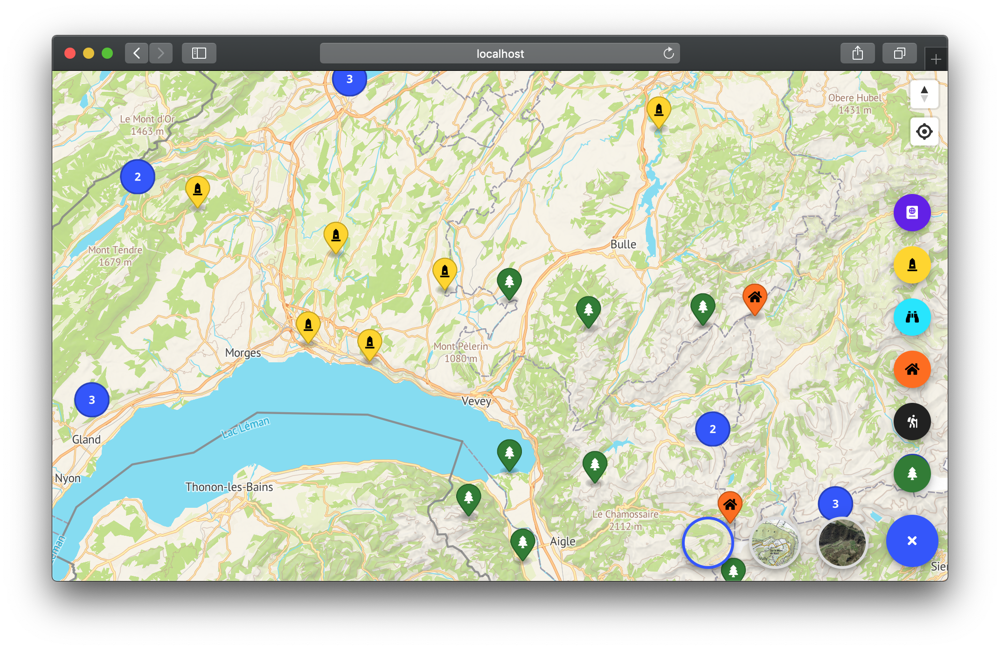
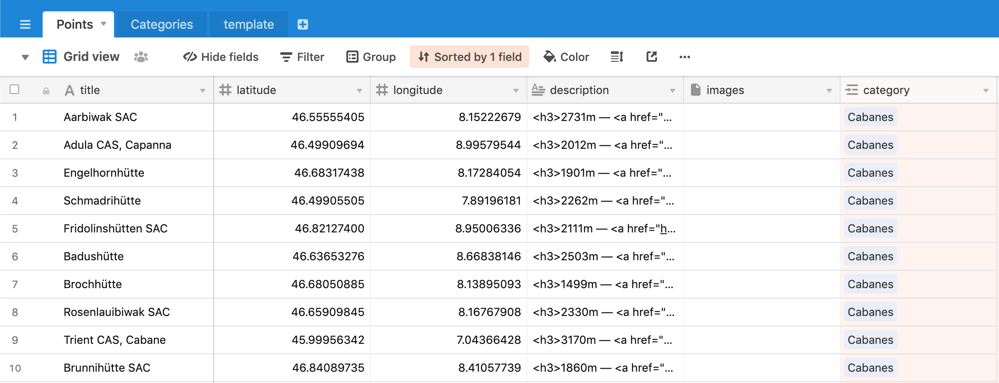
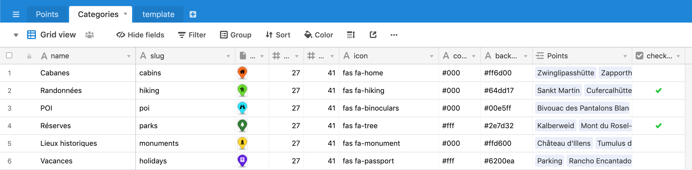

# Mapbook

**Mapbook** a *map application blueprint* based on [React](https://reactjs.org), [Mapbox GL JS](https://docs.mapbox.com/mapbox-gl-js/)  and [Airtable](https://airtable.com). It offers a simple way to manage your points/categories and  to display it in a nice, performant and responsive map interface.



## Installation
First of all, you need to have the following tools installed globally on your environment:
- [📗 NodeJS 10+](https://nodejs.org/en/) - JavaScript runtime used to build the project
- [🐈 Yarn](https://yarnpkg.com/lang/en/) - Dependency manager built on top of the NPM registry

Then, you can install the dependencies :
```bash
$ cd path/to/project
$ yarn install
```

### Airtable setup
**Airtable** is used here as the main data system because of its very simple usage and the out the box JSON REST API that came with. So you will need to create **2 tables** (recommended in the same base). To ease the process, simply use **[this template](https://airtable.com/shr7ZaCBdM4hb5xdk)** and use the `Copy base` button in the **top-right corner**.

---

* `Points` : which will contain all your points related data
	* `title` (string)
	* `latitude` (number)
	* `longitude` (number)
	* `description` (long text) : you can use HTML here
	* `images` (attachment)
	* `category` (single relation)



---

* `Categories` : which will contain the category description
	* `name` (string)
	* `slug` (string)
	* `marker` (attachment) : your marker image
	* `width` (number) : the marker image width
	*  `height` (number) : the marker image height
	* `icon` (string) : should be the same icon CSS classes as the image ([FontAwesome 5](https://fontawesome.com) in the example)
	* `color` (string) : hex color of the icon
	* `background` (string) : hex color of the background
	* `Points` (multiple relations) : automatic points relations
	* `checked` (boolean) : define if its points are displayed by default



---

With the [free plan](https://airtable.com/pricing), you can have up to 1200 records in your base. If, for some reason, you need more, you can subscribe to their *Plus* or *Pro* plan (great products) and if you're still just a broken student, **you can use multiple bases**. Now because relation doesn't work across Airtable bases, instead of a `category` relation field, you need to turn it into a simple `string` field and use the targeted `category` **id** : can be found in the API documentation (`https://airtable.com/YOU_TABLE_ID/api/docs#curl/table:categories`)

### Local configuration
You will also need to duplicate and edit the configuration samples :
```bash
$ cp src/config/map.config.sample.json src/config/map.config.json
$ cp src/config/auth.config.sample.json src/config/auth.config.json
```

`map.config.json` is mainly based on [Mapbox Style Specification](https://docs.mapbox.com/mapbox-gl-js/style-spec/) :

```json
{
  "airtable": {                 ← Your Airtable credentials
    "key": "XXXXXXXXXXXXXXXX",
    "categories": {...},
    "points": {...}             ← Can also be an array of objects for 
                                  multiple Airtable bases use
  },
  
  "styles": {...},              ← Your styles objects made of sources
                                  and layers for map switching
	
  "clusters": {...},            ← The cluster configuration
  "unclustered-points": {...}   ← Map's markers configuration
}
```

👉 You can find great vector styles on [Mapbox](https://www.mapbox.com/) and/or [Maptiler](https://www.maptiler.com/).

`auth.config.json` is used if you want to use Firebase auth system :

```json
{
  "useAuth": true,              ← False if you don't want auth in the app
  "firebase": {...}             ← Your Firebase credentials
}
```

### Layers preview
Depending of your `styles` configuration, if you want a preview for the LayerDial, you can generate and add them to `src/assets` using the style's name as the filename. See existing examples.

## Run and build
**Mapbook** is based on [Create React App](https://github.com/facebookincubator/create-react-app), so the commands are pretty straightforward : 

```bash
$ yarn start    ← start the dev server
$ yarn build    ← build your production assets 
```

## Main resources credits
* [React](https://reactjs.org)
* [Mapbox GL JS](https://docs.mapbox.com/mapbox-gl-js/)
* [Airtable](https://airtable.com)
* [Material-UI](https://material-ui.com/)
* [FontAwesome 5](https://fontawesome.com)
* [React-Firebase](https://react-firebase-js.com/)
* App icon made by [icon 54](https://thenounproject.com/icon54app/)
